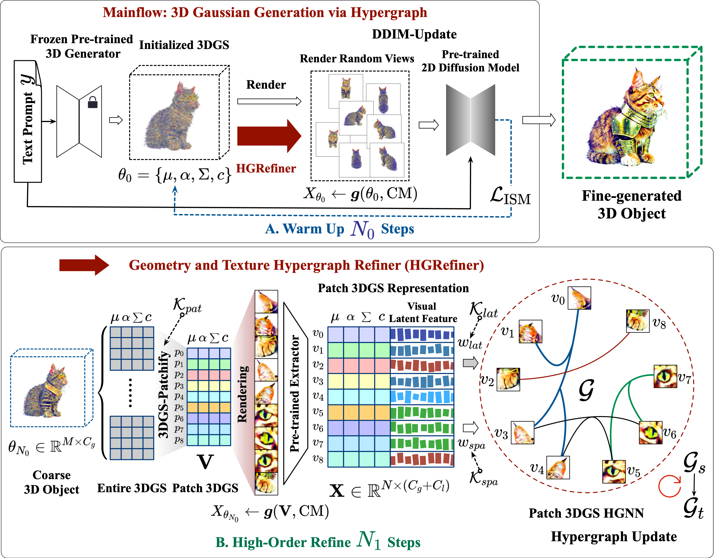
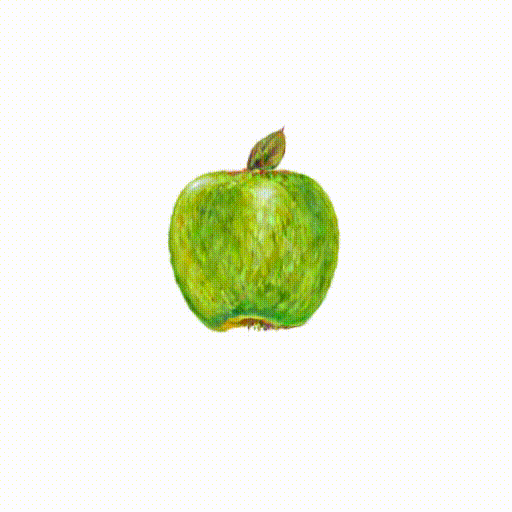

<div align="center">

# Hyper-3DG:<br> Text-to-3D Gaussian Generation via Hypergraph


<p align="center">
<a href="https://arxiv.org/abs/2403.09236"></a>
</p>

<font color=red>**Accepted by IJCV**</font>

**Hyper-3DG pioneers a novel framework for text-to-3D generation that seamlessly integrates hypergraph learning with 3D Gaussian splatting, achieving high-fidelity and structurally coherent 3D models from textual descriptions without compromising computational efficiency.**


</div>


**Abstract:** *Text-to-3D generation represents an exciting field that has seen rapid advancements, facilitating the transformation of textual descriptions into detailed 3D models. However, current progress often neglects the intricate high-order correlation of geometry and texture within 3D objects, leading to challenges such as over-smoothness, over-saturation and the Janus problem. In this work, we propose a method named “3D Gaussian Generation via Hypergraph (Hyper-3DG)”, designed to capture the sophisticated high-order correlations present within 3D objects. Our framework is anchored by a well-established mainflow and an essential module, named “Geometry and Texture Hypergraph Refiner (HGRefiner)”. This module not only refines the representation of 3D Gaussians but also accelerates the update process of these 3D Gaussians by conducting the Patch-3DGS Hypergraph Learning on both explicit attributes and latent visual features. Our framework allows for the production of finely generated 3D objects within a cohesive optimization, effectively circumventing degradation. Extensive experimentation has shown that our proposed method significantly enhances the quality of 3D generation while incurring no additional computational overhead for the underlying framework.*
## Framework


## Video results 
More Video Results [here](contents/Supplementary_material) & Prompts for Showing Videos [here](contents/Supplementary_material/comparison/prompts.txt) and [here](contents/Supplementary_material/user_study/user_study_prompts.txt)

https://github.com/user-attachments/assets/83913e18-7eb7-4dda-94b7-275f8336f09c

https://github.com/user-attachments/assets/13263ce7-d63a-4c35-888b-926edc589d94

https://github.com/user-attachments/assets/03ba1ebe-3961-4b3e-b036-2bcb905d2e60

https://github.com/user-attachments/assets/63526bfa-874d-441c-b651-3496ac111960

https://github.com/user-attachments/assets/af150e12-b3a1-4569-8f8d-592d9f75d2cd

https://github.com/user-attachments/assets/3d308045-f445-46a9-9565-9bf5d4184ba9


## Acknowledgements

We would like to express our gratitude to the authors of the following works, which have greatly influenced our project:

- [LucidDreamer](https://github.com/EnVision-Research/LucidDreamer)
- [Shap-E](https://github.com/openai/shap-e) & [Point-E](https://github.com/openai/point-e)
- [3D Gaussian Splatting](https://github.com/graphdeco-inria/gaussian-splatting)
- [Threestudio](https://github.com/threestudio-project/threestudio)


# Citation
```shell
@misc{di2024hyper3dg,
      title={Hyper-3DG: Text-to-3D Gaussian Generation via Hypergraph}, 
      author={Donglin Di and Jiahui Yang and Chaofan Luo and Zhou Xue and Wei Chen and Xun Yang and Yue Gao},
      year={2024},
      eprint={2403.09236},
      archivePrefix={arXiv},
      primaryClass={cs.CV}
}
```


<!-- #### A DSLR Photo of a bald eagle


#### A DSLR Photo of a bloody lion with sharp tooth


#### A pair of green headphones

https://github.com/user-attachments/assets/8f15a379-cfcc-47be-9c0b-1aeec79dd9fb 

#### A cat wearing armor


#### A DSLR photo of a handbag


#### A DSLR photo of a pink luxury family SUV


#### A sleek cyberpunk fighter jet adorned with neon lights and chrome plating, ultra realistic, 8k, HD


#### a steam engine train, high resolution


#### An apple


#### flamethrower, with fire, scifi, cyberpunk, photorealistic, 8K, HD


#### A DSLR photo of a corgi


#### A classic packard car


#### A ceramic lion
https://github.com/yjhboy/Hyper3DG/assets/101305907/0731db49-c0f8-4085-9bf0-ce5d6c6d3bb9

#### a tulip
https://github.com/yjhboy/Hyper3DG/assets/101305907/b57d9e54-030b-43c4-9bf4-398ffbac0fd9

#### an astronaut in sand beach
https://github.com/yjhboy/Hyper3DG/assets/101305907/423b248f-c150-4e9b-a007-510e6feb90fc

#### an ice cream
https://github.com/yjhboy/Hyper3DG/assets/101305907/3048f859-04eb-4b87-91c6-66ab9766b6f1

#### A beagle in a detectives outfit
https://github.com/yjhboy/Hyper3DG/assets/101305907/d25f8f28-f1ea-4b2f-986b-2b4a68c95bc9 -->


