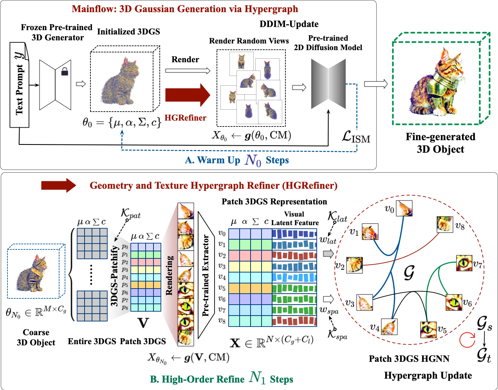

# Hyper-3DG: Text-to-3D Gaussian Generation via Hypergraph
Donglin Di, Jiahui Yang, Chaofan Luo, Zhou Xue, Wei Chen, Xun Yang, Yue Gao

Li Auto Space AI, School of Software (Tsinghua University), School of Information Science and Technology (University of Science and Technology of China), Harbin Institute of Technology

[Full Paper](https://www.researchsquare.com/article/rs-4084374/v1)

Abstract: *Text-to-3D generation represents an exciting field that has seen rapid advancements, facilitating the transformation of textual descriptions into detailed 3D models. However, current progress often neglects the intricate high-order correlation of geometry and texture within 3D objects, leading to challenges such as over-smoothness, over-saturation and the Janus problem. In this work, we propose a method named “3D Gaussian Generation via Hypergraph (Hyper-3DG)”, designed to capture the sophisticated high-order correlations present within 3D objects. Our framework is anchored by a well-established mainflow and an essential module, named “Geometry and Texture Hypergraph Refiner (HGRefiner)”. This module not only refines the representation of 3D Gaussians but also accelerates the update process of these 3D Gaussians by conducting the Patch-3DGS Hypergraph Learning on both explicit attributes and latent visual features. Our framework allows for the production of finely generated 3D objects within a cohesive optimization, effectively circumventing degradation. Extensive experimentation has shown that our proposed method significantly enhances the quality of 3D generation while incurring no additional computational overhead for the underlying framework.*

## Video results
https://github.com/yjhboy/Hyper-3DG/blob/main/contents/a_bald_eagle.mp4

<!-- 
<video controls> <source src="contents/a_bald_eagle.mp4" type="video/mp4"> NO! </video> -->

# Citation
Donglin Di, Jiahui Yang, Chaofan Luo et al. Hyper-3DG: Text-to-3D Gaussian Generation via Hypergraph, 12 March 2024, PREPRINT (Version 1) available at Research Square [https://doi.org/10.21203/rs.3.rs-4084374/v1]
